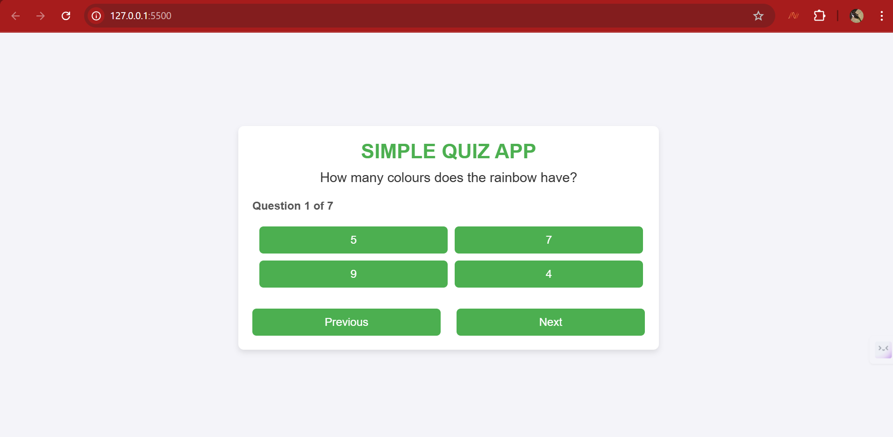
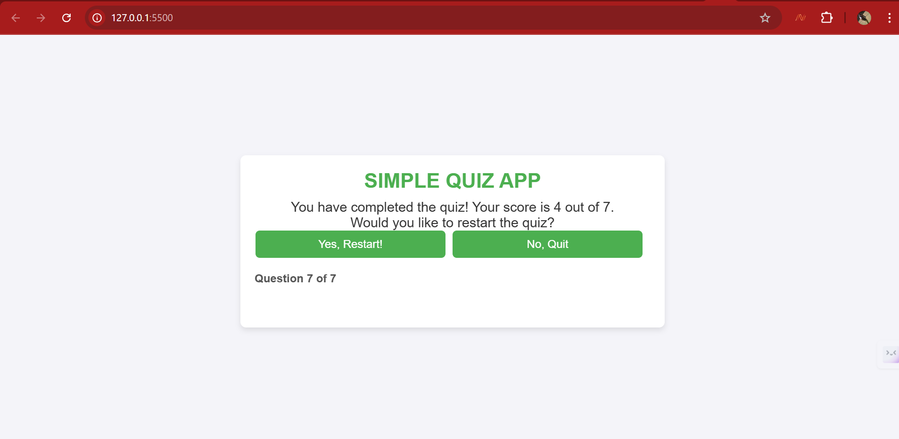

# Simple Quiz App

This is a simple web-based quiz app that presents multiple-choice questions to the user. It allows the user to track their score, navigate through questions, and even restart the quiz after completion. The app is built using HTML, CSS, and JavaScript.

## Features

- **Display Questions**: The app displays one multiple-choice question at a time.
- **Select Answers**: Users can select an answer from multiple options.
- **Track Score**: The app tracks the user's score based on correct answers.
- **Progress Indicator**: The app shows which question the user is on (e.g., "Question 3 of 10").
- **Results Screen**: After completing the quiz, the user is shown their score and can restart the quiz if they wish.


### Installation

1. **Clone the repository:**

   ```
   git clone https://github.com/EjikeJosephUche/simple_quiz_app.git
   cd simple-quiz-app
   ```

2. **Project Files:**

   The project consists of the following main files:
   - `index.html`: The main HTML file where the structure of the quiz is defined.
   - `style.css`: The CSS file for styling the app.
   - `app.js`: The main JavaScript file for handling the quiz logic.
   - `questions.js`: The JavaScript file containing the questions and answers.

3. **Open the project in a browser:**

   install live server from extensions market place in VS Code or any other Text editor you wish to use and use it to open index.html

4. **Start the Quiz:**
   - Open the app in your browser.
   - Answer the questions one by one.
   - At the end of the quiz, you can see your score and choose to restart the quiz.

## File Structure

```
/simple-quiz-app
    ├── index.html
    ├── style.css
    ├── app.js
    └── questions.js
```

- `index.html`: Contains the HTML structure of the app.
- `style.css`: Handles the styling and layout of the app.
- `app.js`: Contains the logic for loading questions, checking answers, and tracking the score.
- `questions.js`: Contains the array of quiz questions and correct answers.

## How It Works

1. **Loading Questions**: Questions are stored in `questions.js` and imported into `app.js`. Each question has a text, a set of multiple-choice options, and a correct answer.
2. **Navigation**: The user can navigate through the questions using the "Next" and "Previous" buttons.
3. **Tracking Score**: Each time a user selects an option, the app checks if the answer is correct and keeps track of the score.
4. **Result & Restart**: When the user completes the quiz, they are shown their final score. They are then prompted to restart the quiz if they want to try again.

## Screenshots

**Quiz App in Action:**
1. **Question Screen**  
   
   
2. **Results Screen**  
   

## Future Improvements
I'll likely want to add these fueatures in the future as its not mandatory

- **Timer**: Add a timer to make the quiz time-bound.
- **Difficulty Levels**: Implement different difficulty levels for questions.
- **User Authentication**: Allow users to save their scores and track progress over time.
- **Randomize Questions**: Display questions in a random order each time the quiz is taken.

## Contributing

Feel free to fork the repository and submit pull requests with improvements or bug fixes. If you have suggestions for new features, please open an issue.